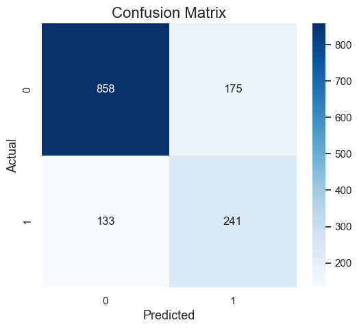
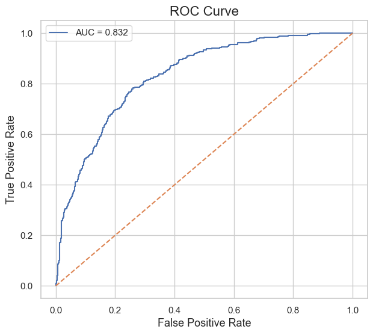
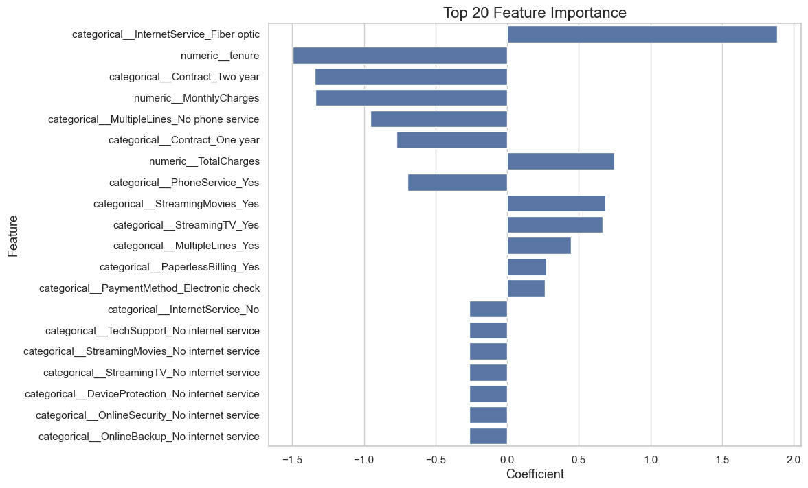
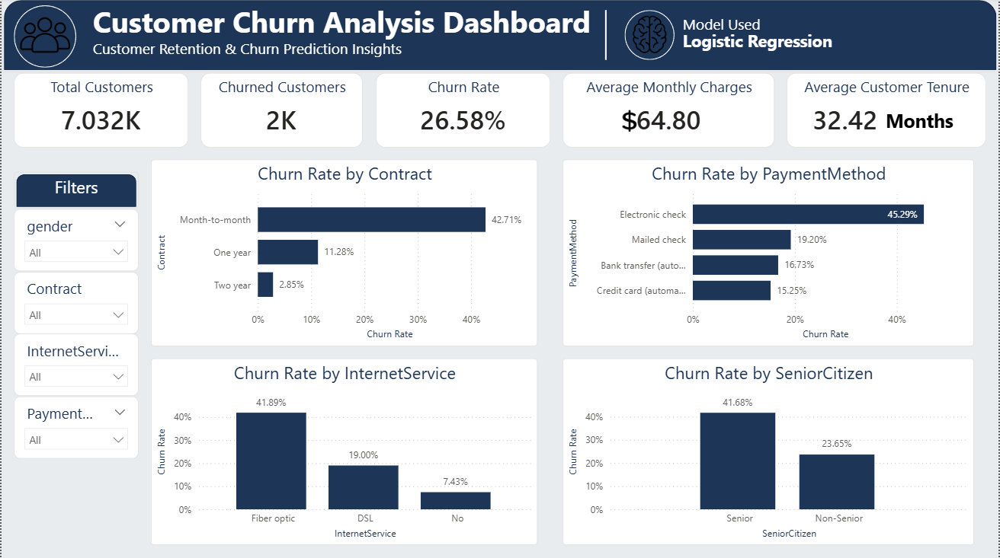
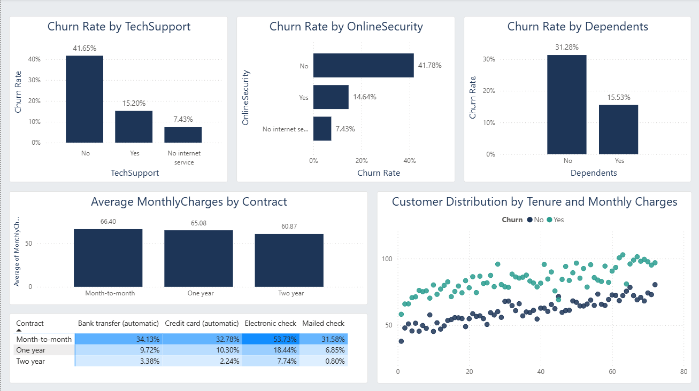

# 📉 Telco Customer Churn — Prediction & Analytics Dashboard

An end-to-end data science project that analyzes customer churn behavior for a telecommunications company, builds a machine learning model to predict churn, and presents the findings through an interactive Power BI dashboard.


---

## 📌 Project Overview

Customer churn — when a customer stops doing business with a company — is one of the most critical metrics for subscription-based businesses like telecom providers. This project combines **exploratory data analysis (EDA)**, **machine learning classification**, and **business intelligence dashboarding** to:

1. Understand _why_ customers churn.
2. Predict _which_ customers are likely to churn.
3. Present actionable insights to stakeholders in a clean, interactive dashboard.

---

## 🗂️ Dataset

- **Source:** [Telco Customer Churn Dataset](https://www.kaggle.com/datasets/blastchar/telco-customer-churn) (IBM Sample Dataset)
- **Records:** 7,043 customers (7,032 after cleaning)
- **Features:** 21 columns, including demographics, account information, subscribed services, and billing details
- **Target variable:** `Churn` (Yes / No)

| Category     | Example Features                                                                                     |
| ------------ | ---------------------------------------------------------------------------------------------------- |
| Demographics | `gender`, `SeniorCitizen`, `Partner`, `Dependents`                                                   |
| Account Info | `tenure`, `Contract`, `PaperlessBilling`, `PaymentMethod`                                            |
| Services     | `PhoneService`, `InternetService`, `OnlineSecurity`, `TechSupport`, `StreamingTV`, `StreamingMovies` |
| Billing      | `MonthlyCharges`, `TotalCharges`                                                                     |

---

## 🔍 Exploratory Data Analysis — Key Insights

- The dataset is **imbalanced**: most customers do not churn, so accuracy alone is not a sufficient evaluation metric.
- Customers who churn tend to have **significantly shorter tenure**.
- Customers who churn tend to have **higher monthly charges** on average.
- **Contract type** is a strong churn predictor:
  - Month-to-month: **42.7%** churn rate
  - One-year: **11.3%** churn rate
  - Two-year: **2.9%** churn rate
- **Fiber optic** internet customers churn more than DSL customers.
- **Electronic check** payers have the highest churn rate (**~45%**), while automatic payment methods (bank transfer / credit card) show much lower churn (~15–17%).

---

## 🤖 Machine Learning Pipeline

### Preprocessing

- Removed rows with missing `TotalCharges` values and converted the column to numeric.
- Dropped the non-predictive `customerID` column.
- Built a `ColumnTransformer` pipeline:
  - **Numeric features** (`tenure`, `MonthlyCharges`, `TotalCharges`) → `StandardScaler`
  - **Categorical features** → `OneHotEncoder` (drop first category)
  - **Binary feature** (`SeniorCitizen`) → passthrough

### Models Compared

Five classification algorithms were trained and evaluated using cross-validation:

| Model                        |
| ---------------------------- |
| Logistic Regression          |
| K-Nearest Neighbors (KNN)    |
| Support Vector Machine (SVM) |
| Decision Tree                |
| Random Forest                |

Each model was tuned using **`GridSearchCV`** (10-fold cross-validation) optimized for **F1-score**, since the dataset is imbalanced and both false positives and false negatives carry business cost.

### 🏆 Best Model: Logistic Regression

- **Hyperparameters:** `C=10`, `solver='lbfgs'`
- **Decision threshold:** 0.4 (tuned to improve recall on the churn class)

---

## 📊 Model Performance

<table>
<tr>
<td>

**Confusion Matrix**

|                 | Predicted: No | Predicted: Yes |
| --------------- | ------------- | -------------- |
| **Actual: No**  | 858           | 175            |
| **Actual: Yes** | 133           | 241            |

</td>
<td>

**Metrics**

| Metric            | Score |
| ----------------- | ----- |
| Accuracy          | 78.1% |
| Precision (Churn) | 57.9% |
| Recall (Churn)    | 64.4% |
| F1-Score (Churn)  | 61.0% |
| ROC-AUC           | 0.832 |

</td>
</tr>
</table>




The model achieves a strong **ROC-AUC of 0.832**, indicating good separability between churned and retained customers. The threshold was intentionally lowered to 0.4 to prioritize **recall**, since failing to identify an at-risk customer (false negative) is typically more costly to the business than a false alarm.

### Feature Importance



Top drivers of churn (by logistic regression coefficient magnitude):

- `InternetService_Fiber optic` — strongest positive driver of churn
- `tenure` — strongest negative driver (longer tenure → less churn)
- `Contract_Two year` / `Contract_One year` — long-term contracts reduce churn risk
- `MonthlyCharges` — higher charges are associated with lower churn likelihood _(coefficient direction; see notebook for full interpretation in context of correlated features)_
- `TotalCharges`, `StreamingTV`, `StreamingMovies`, `PaperlessBilling`, `PaymentMethod_Electronic check` — additional positive churn indicators

---

## 📈 Power BI Dashboard

An interactive Power BI dashboard was built to make the analysis accessible to non-technical stakeholders, with dynamic slicers for `gender`, `Contract`, `InternetService`, and `PaymentMethod`.




**Dashboard highlights:**

- KPI cards: Total Customers, Churned Customers, Churn Rate, Average Monthly Charges, Average Customer Tenure
- Churn Rate breakdown by Contract, Payment Method, Internet Service, Senior Citizen, Tech Support, Online Security, Dependents
- Cross-tabulated matrix: Churn Rate by Contract × Payment Method
- Scatter plot: Customer distribution by Tenure and Monthly Charges, colored by churn status

---

## 🛠️ Tech Stack

| Category          | Tools               |
| ----------------- | ------------------- |
| Language          | Python 3.10+        |
| Data Manipulation | pandas, numpy       |
| Visualization     | matplotlib, seaborn |
| Machine Learning  | scikit-learn        |
| Dashboarding      | Power BI            |
| Environment       | Jupyter Notebook    |

---

## 📁 Project Structure

```
telco-customer-churn/
│
├── data/
│   └── WA_Fn-UseC_-Telco-Customer-Churn.csv
│
├── notebook/
│   └── Customer_Churn_Notebook.ipynb
│
├── dashboard/
│   └── Customer_Churn_Dashboard.pbix
│
├── assets/
│   ├── confusion_matrix.png
│   ├── roc_curve.png
│   ├── feature_importance.png
│   ├── dashboard_preview_1.png
│   └── dashboard_preview_2.png
│
└── README.md
```

### View the Dashboard

Open `dashboard/Customer_Churn_Dashboard.pbix` in **Power BI Desktop**.

---

## 💡 Business Insights & Recommendations

- **Target month-to-month customers** with retention offers — they represent the highest-risk segment by far.
- **Incentivize longer contracts** (one-year / two-year) through discounts, since contract length is the strongest churn predictor.
- **Investigate the Fiber optic experience** — pricing, service quality, or competition may be driving elevated churn.
- **Promote automatic payment methods** over electronic checks, as they correlate with meaningfully better retention.
- **Prioritize retention outreach** using the model's churn probability scores to focus efforts on the highest-risk customers first.

---

## 👤 Author

**Ahmed** — Computer Science Student, Faculty of Computers and Artificial Intelligence, Cairo University

---

## 📄 License

This project is for educational purposes, using a publicly available dataset (IBM Sample Data Sets, distributed via Kaggle).
